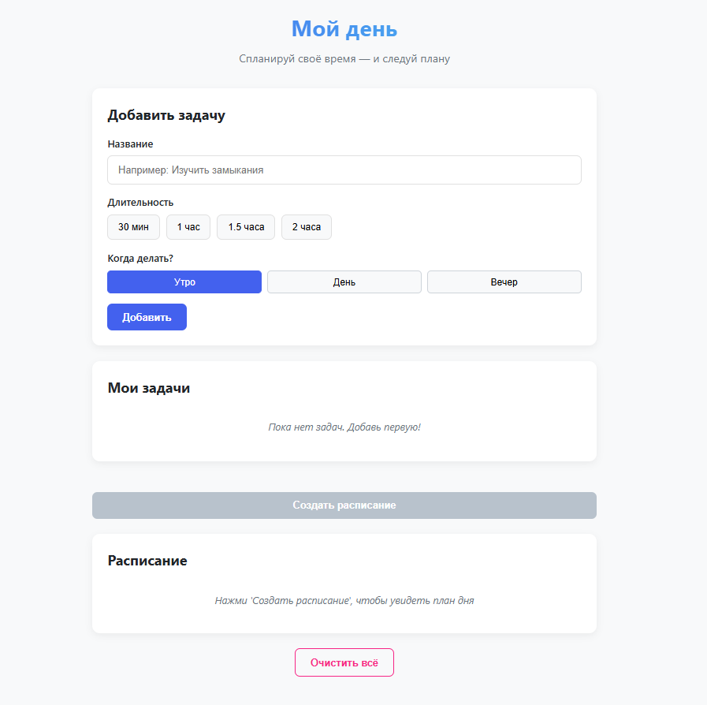
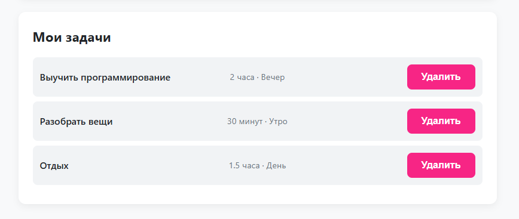
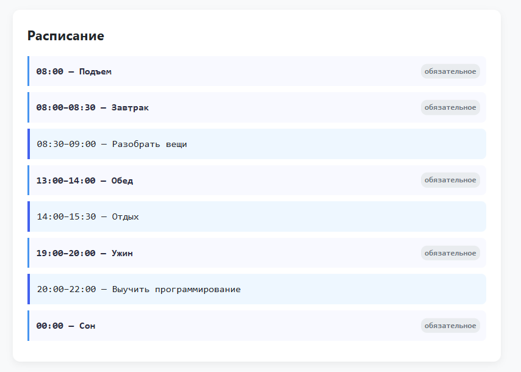

# 🕒 Планировщик дня

**Интерактивный планировщик с учётом биоритмов** — инструмент, который помогает распределить задачи по продуктивным периодам дня, учитывая завтрак, обед, ужин и сон.

> 💡 Не просто To-Do лист, а **осознанное планирование**, которое уважает твой режим дня.

Главный экран:  


Список задач:  


Сгенерированное расписание:  


## 🔍 Возможности

- ✅ Добавление задач с выбором:
  - **Длительности**: 30 мин, 1 ч, 1.5 ч, 2 ч
  - **Временного блока**: утро (08:30–13:00), день (14:00–19:00), вечер (20:00–00:00)
- ✅ Автоматическая генерация расписания с фиксированными событиями:
  - Подъём (08:00)
  - Завтрак (08:30–09:00)
  - Обед (13:00–14:00)
  - Ужин (19:00–20:00)
  - Сон (с 00:00)
- ✅ Все данные сохраняются в **localStorage** — задачи не исчезают при перезагрузке
- ✅ Адаптивный и современный интерфейс
- ✅ Удаление и очистка задач

## 🛠️ Технологии

- **HTML5**, **CSS3** (Flexbox, кастомные свойства, анимации)
- **Vanilla JavaScript** (без фреймворков!)
- Работа с:
  - DOM и событиями
  - `localStorage`
  - временем и датами
  - алгоритмами распределения задач по слотам

## 🚀 Как запустить

- Клонируй репозиторий:
  ```bash
  git clone https://github.com/24578067/day-planner.git
  ```
